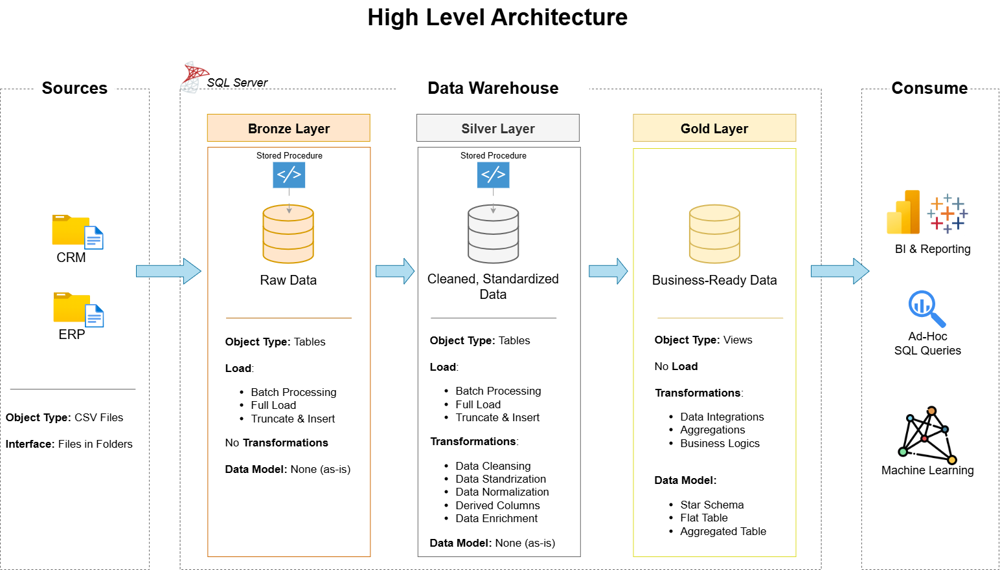

# SQL Data Warehouse Project

---

## Table of Contents

- [About](#about)  
- [Architecture](#architecture)  
- [Getting Started](#getting-started)  
- [Usage](#usage)  
- [Contributing](#contributing)  
- [License](#license)

---

## About

This project demonstrates the design and implementation of a modern **Data Warehouse** using a multi-layered architecture (Bronze, Silver, and Gold layers).  
The goal is to ingest raw data from different sources, transform and clean it, and prepare high-quality datasets that can be consumed by analytics and visualization tools.  

**Key Features**:
- Ingests CRM and ERP source data.  
- Implements ELT/ETL pipelines to handle raw, cleaned, and curated data.  
- Organizes data into **Bronze (raw)**, **Silver (cleaned)**, and **Gold (business-ready)** layers.  
- Built using SQL Server with schema management for scalability.  

---

## Architecture

The data flow follows the **medallion architecture**:

1. **Sources**: Data is collected from CRM and ERP systems.  
2. **Bronze Layer**: Stores raw ingested data in its original form for audit and reprocessing.  
3. **Silver Layer**: Cleans and transforms data, ensuring consistency and applying business rules.  
4. **Gold Layer**: Stores aggregated and business-ready data models for analysis.  
5. **Consume**: Data is visualized and consumed through BI tools such as Power BI, Tableau, and Google Data Studio.

---

## Getting Started

### Prerequisites
- SQL Server / Azure SQL Database  
- SQL Server Management Studio (SSMS)  
- Basic knowledge of SQL and ETL concepts  

### Steps
1. Clone the repository:  
   \`\`\`bash
   git clone https://github.com/your-username/sql-data-warehouse-project.git
   cd sql-data-warehouse-project
   \`\`\`

2. Create the database:  
   \`\`\`sql
   CREATE DATABASE DataWarehouse;
   \`\`\`

3. Run the scripts provided in the `datasets/` and `scripts/` folders to create schemas and load data.

---

## Usage

- Use the Bronze tables for auditing raw source data.  
- Run transformation scripts to populate the Silver layer with cleaned, structured data.  
- Generate aggregated reports and KPIs from the Gold layer.

---

## Contributing

Contributions are welcome!  
- Fork the repository  
- Create a new branch (`feature/your-feature`)  
- Commit your changes  
- Open a Pull Request  

---

## License

This project is licensed under the **MIT License**.  
